# Django站点管理

假设我们要设计一个新闻网站，我们需要编写展示给用户的页面，网页上展示的新闻信息是从哪里来的呢？**是从数据库中查找到新闻的信息，然后把它展示在页面上**。但是我们的网站上的新闻每天都要更新，这就意味着对数据库的增、删、改、查操作，那么我们需要每天写sql语句操作数据库吗? 如果这样的话，是不是非常繁琐，所以我们可以设计一个页面，通过对这个页面的操作来实现对新闻数据库的增删改查操作。那么问题来了，老板说我们需要在建立一个新网站，是不是还要设计一个页面来实现对新网站数据库的增删改查操作，但是这样的页面具有一个很大的重复性，那有没有一种方法能够让我们很快的生成管理数据库表的页面呢？**有，那就是我们接下来要给大家讲的Django的后台管理**。Django能够根据定义的模型类自动地生成管理页面。

使用Django的管理模块，需要按照如下步骤操作：

- 1.管理界面本地化
- 2.创建管理员
- 3.注册模型类
- 4.自定义管理页面

## 1 管理界面本地化

本地化是将显示的语言、时间等使用本地的习惯，这里的本地化就是进行中国化，中国大陆地区使用简体中文，时区使用亚洲/上海时区，注意这里不使用北京时区表示。

打开test1/settings.py文件，找到语言编码、时区的设置项，将内容改为如下：

```
LANGUAGE_CODE = 'zh-hans' #使用中国语言
TIME_ZONE = 'Asia/Shanghai' #使用中国上海时间
```

## 2 创建管理员

创建管理员的命令如下，按提示输入用户名、邮箱、密码。

```
python manage.py createsuperuser
```

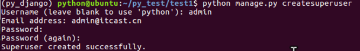

接下来启动服务器。

```
python manage.py runserver
```

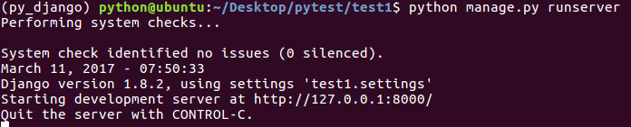

打开浏览器，在地址栏中输入如下地址后回车。

```
http://127.0.0.1:8000/admin/
```

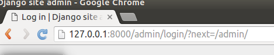

输入前面创建的用户名、密码完成登录。

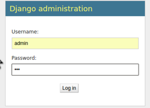

登录成功后界面如下，但是并没有图书、英雄的管理入口，接下来进行第三步操作。

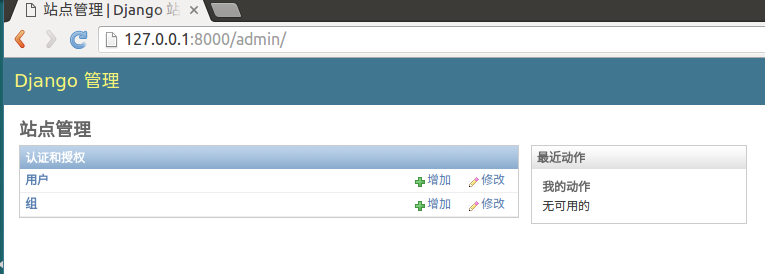

## 3 注册模型类

登录后台管理后，默认没有我们创建的应用中定义的模型类，需要在自己应用中的admin.py文件中注册，才可以在后台管理中看到，并进行增删改查操作。

打开booktest/admin.py文件，编写如下代码：

```
from django.contrib import admin
from booktest.models import BookInfo,HeroInfo

admin.site.register(BookInfo)
admin.site.register(HeroInfo)
```

到浏览器中刷新页面，可以看到模型类BookInfo和HeroInfo的管理了。

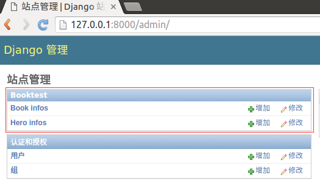

点击类名称"BookInfo"可以进入列表页，默认只有一列。

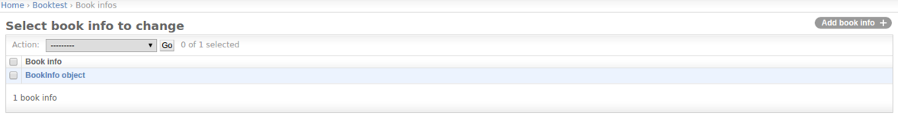

在列表页中点击"增加"可以进入增加页，Django会根据模型类的不同，生成不同的表单控件，按提示填写表单内容后点击"保存"，完成数据创建，创建成功后返回列表页。

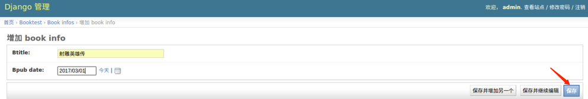

在列表页中点击某行的第一列可以进入修改页。

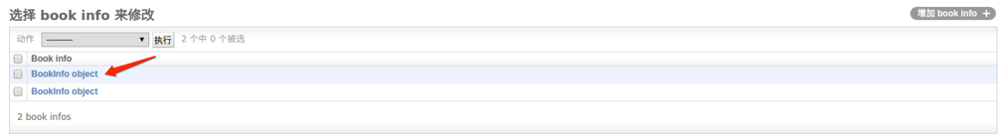

按照提示进行内容的修改，修改成功后进入列表页。在修改页点击“删除”可以删除一项。

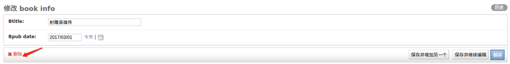

删除：在列表页勾选想要删除的复选框，可以删除多项。

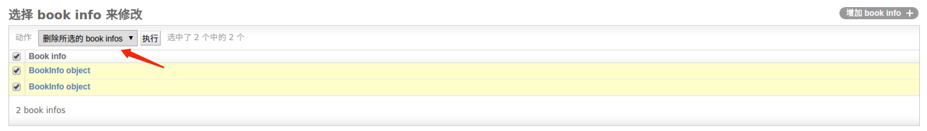

点击执行后进入确认页面，删除后回来列表页面。

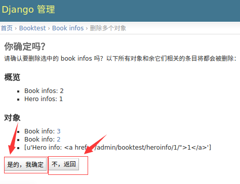

数据都删除了，接下来手动造一些数据出来。

## 4 自定义管理页面

在列表页只显示出了BookInfo object，对象的其它属性并没有列出来，查看非常不方便。 Django提供了自定义管理页面的功能，比如列表页要显示哪些值。

打开booktest/admin.py文件，自定义类，继承自admin.ModelAdmin类。

- 属性list_display表示要显示哪些属性

```
class BookInfoAdmin(admin.ModelAdmin):
    list_display = ['id', 'btitle', 'bpub_date']
```

- 修改模型类BookInfo的注册代码如下

```
admin.site.register(BookInfo, BookInfoAdmin)
```

- 刷新BookInfo的列表页，所有属性都显示出来了

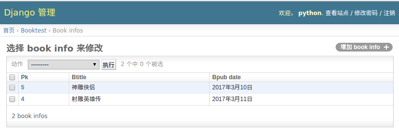

- 最终booktest/admin.py文件代码如下

```
from django.contrib import admin
from booktest.models import BookInfo,HeroInfo

class BookInfoAdmin(admin.ModelAdmin):
    list_display = ['id', 'btitle', 'bpub_date']
class HeroInfoAdmin(admin.ModelAdmin):
    list_display = ['id', 'hname','hgender','hcomment']

admin.site.register(BookInfo,BookInfoAdmin)
admin.site.register(HeroInfo,HeroInfoAdmin)
```
## 5 站定重命名

默认站点显示的是“Django 管理”，所以需要重新命名。